# "Host-pool-management-approaches"
  
Actuellement pour gérer le cycle de vie des **"Session hosts"** dans un **"Host Pool Azure virtual Desktop (AVD)"**, cela peut se faire avec plusieurs approches:
- Avec Microsoft Intune
- Avec la création de nouvelles images
- Avec la combinaison des deux

## Avec Microsoft Intune
L'intégration d’Azure Virtual Desktop (AVD) avec Microsoft Intune permet de gérer les machines virtuelles (Session hosts) de manière centralisée, en appliquant des stratégies de sécurité, des mises à jour et des configurations aux VMs. Microsoft Intune permet une gestion centralisée des VMs AVD sans nécessiter une **reconstruction régulière des images de VMs (hosts AVD)**.

## Avec la création de nouvelles images
La gestion des mises à jour des machines AVD avec de nouvelles images permet d'éviter une dette technique (mise à jour des applications) et de garantir des performances stables. Cela nécessite de recréer régulièrement des images de VMs (Session hosts AVD) pour appliquer les mises à jour et les applications. Cela peut être fait avec des outils comme **"Azure Image Builder ou Packer (HashiCorp)"** et des chaînes de déploiement tel que **"Azure DevOps/ GitHub / ..."**.  
Avec cette approche, on est obligé de gérer les mises à jour des sessions hosts soit en **créant un nouveau "Host pool"** avec les nouvelles images ou soit **en ajoutant des nouveaux "Session host" à un "Host pool"** avec les nouvelles images.  
**Création d'un nouveau "Host pool"**: 
- Crétion d'une nouvelle image en la stockant dans **"Azure Compute Gallery"**
- Redéploiement d'un "Host pool" avec la nouvelle image
- Nettoyage de l'Entra ID ou de l'Acive Directory (comptes machine) le fait de devoir progressivement supprimer les anciens hôtes mis en drain mode
- Re création d'**Application group & "Assignments"**

**En ajoutant des nouveaux "Session host" à un "Host pool"**: 
- Crétion d'une nouvelle image en la stockant dans **"Azure Compute Gallery"**
- Génération d'une nouvelle clé au niveau du **"Host pool"** pour l'ajout des nouveaux **Session host**
- Déploiement des nouveaux **Session host**
- Jouer avec le "Drain mode"
- Une fois les nouveaux **Session host** déployés il faudra nettoyage de l'Entra ID ou de l'Acive Directory (comptes machine)

## Avec la combinaison des deux
Utiliser Intune si l'on veut une gestion continue et éviter de recréer les VMs fréquemment. 
Utiliser la création de nouvelles images si l'on veut garantir des performances stables et minimiser une dette technique sur le long terme. 
Il est possible de combiner les deux approches pour bénéficier des avantages de chacune. Utiliser Intune pour les petits changements et faire des nouvelles **images tous les 3-6 mois** pour une base propre testée et performante. 
C'est souvent cette option qui est recommandée et utilisée pour les environnements de production. 

## Nouveauté "Host pool management approaches"
Microsoft propose maintenant une nouvelle fonctionnalité dans **"Azure Virtual Desktop"** pour le déploiement des "Host pool" et surtout pour la gestion du cycle de vie des **Session host**. On peut également profiter de cette nouvelle fonctionnalité pour changer aussi le hardware (Sizing des VM), les types des disques (SSD/Premium) et les custom scripts.  
Cette nouvelle fonctionnalité **"Host pool management approaches"** est encore en **preview** et ne fonctionne uniquement dans un environnement **"Domaine Active Directory ou Microsoft Entra Domain Services"**. Egalement, **elle n'est supporté qu'en mode "Pooled" pour "Host pool"**.  
Les prérequis pour déployer cette nouvelle fonctionnalité: 
- Active Directory avec Entra Domain Services ou domaine ADDS et des permissions spécifiques sur l’OU ( des "Session host)" dans le cas ADDS
- Uniquement des systèmes d'exploitation Windows 10/11 en Gen 2
- KeyVault pour stocker les login et mot de passe (compte pour mettre les machines session host dans le domaine ainsi compte admin local session host). Ainsi il faudra autoriser le déploiement de « template ARM » au niveau du KeyVault
- Valider la stratégie "Domain controller: Allow computer account re-use during domain join" (https://learn.microsoft.com/en-us/azure/virtual-desktop/session-host-update-configure?tabs=portal)
- Pour les environnement ADDS locaux, ajouter les permissions au niveau de l'OU (Session host) (https://learn.microsoft.com/en-us/azure/virtual-desktop/session-host-update-configure?tabs=portal)
- Rôles:
    - "Desktop Virtualization Virtual Machine Contributor" pour le principal de service AVD
    - "KeyVault secret user" pour le principal de service AVD
    - "KeyVault administrator" pour l’administrateur sécurité en charge de gérer les secrets
    - Propriétaire ou contributeur sur le groupe de ressources ou la souscription hébergeant les hôtes de sessions
    
    Pour déployer et gérer le cycle de vie avec cette nouvelle fonctionnalité **"Host pool management approaches"**, c'est très simple. 
    Dans l'assistant pour créer un nouveau Host pool, on voit la nouvelle fonctionnalité.  
    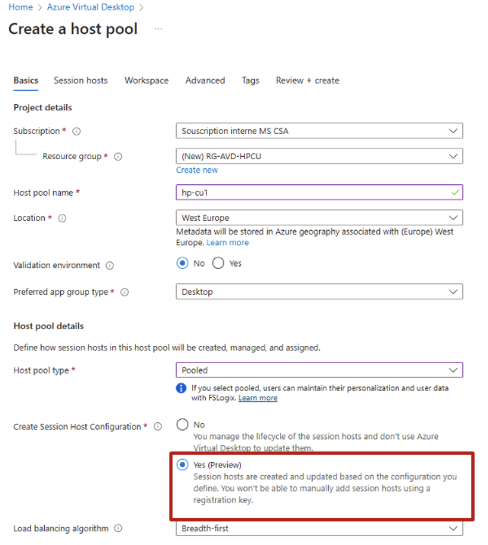  
    On choisit l'image (MarketPlace ou une image dans une Gallery)  
    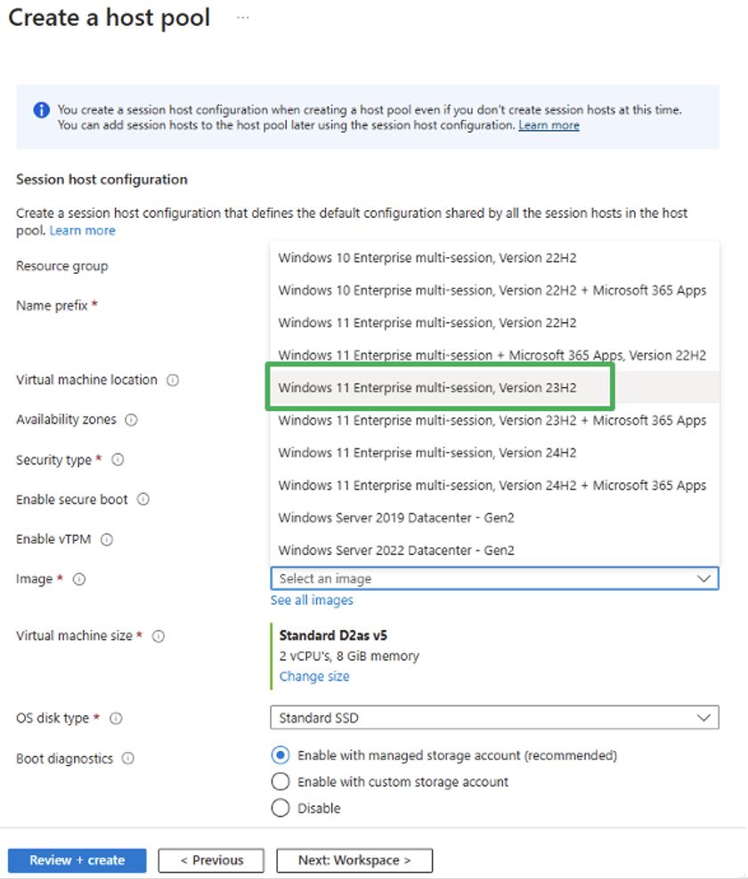  
    Après avoir choisi : le gabarit de la VM - le type de disque - la partie réseau avec le subnet qui peut joindre les contôleurs de domaine ou le domaine Entra Domain Service  
    (Nouveau) On vient renseigner les éléments dans le KeyVault : Login & mot de passe (compte admin local des "session host" et le compte AD ayant les droits de mettre session host dans le domaine AD).  
    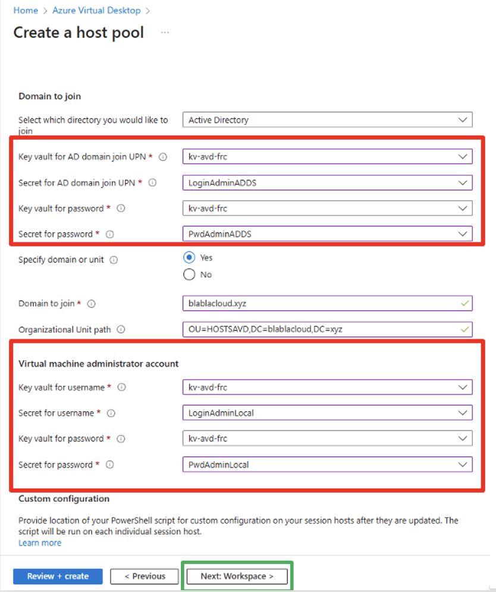  

A la fin du déployment, on peut remarquer au niveau du "host pool" deux nouvelles colonnes "Curent Version" et "Target Version" qui correspondent à la version des "session host" au format "timestamp".   
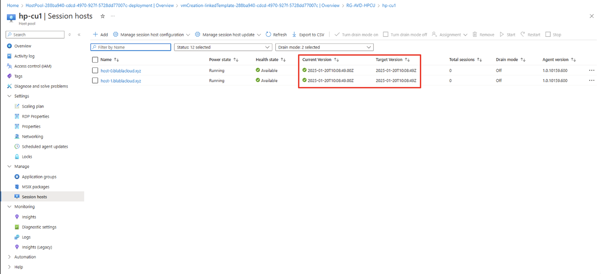  
Pour les plus curieux, il n'y a plus qu'une extention au niveau "des session host", la "Microsoft.PowerShell.DSC" (Installation des agents AVD & la jonction au domaine AD).  Ne cherchez pas l'extention "JsonADDomainExtension".   
Pour l'ajout de "session host", plus besoin de générer une nouvelle "Registration key", il suffit de cliquer sur "add" et on suit l'assitant.  
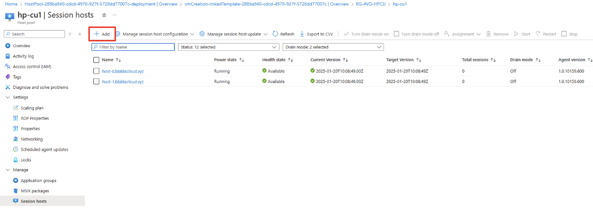   

**Le plus interressant !** la mise à jour des **"session host"**
Il suffit le lancer l'assitant.   
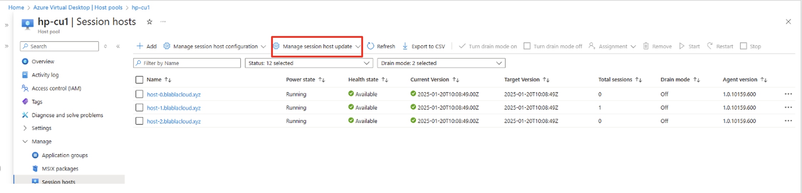  
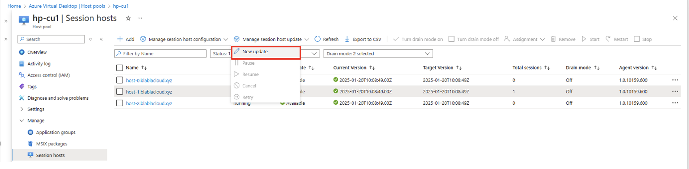  

Pour la partie orchestration de la mise à jour des "session host" 
On va venir paramétrer :
- le lot de "session host" que l'on souhaite mettre à jour en même temps
- le nombre de "session host" que l'on souhaite garder opérationnel pendant la mise à jour

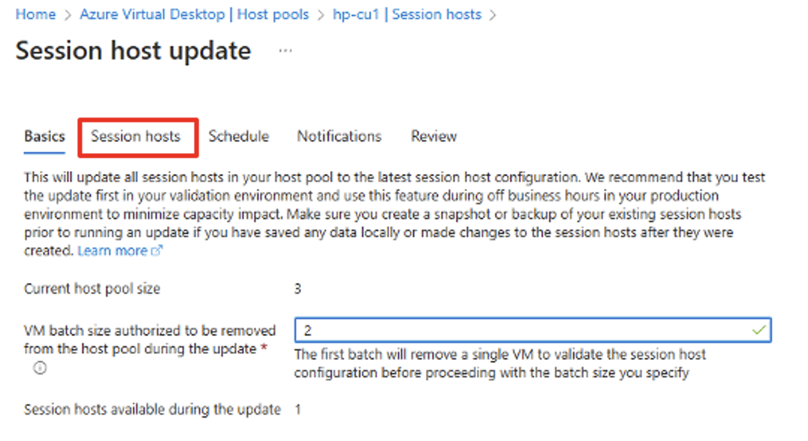  

Ce qui faut savoir, avant d'exécuter une mise à jour des "session host", le service prend un "session host", le test ( check l'agent AVD & si le session host est bien resté dand l'AD) et le service lance le processus de mise à jour des autres "session host".  

Ensuite on selectionne la nouvelle image, éventuellement un nouveau gabarit de VM et les éléments dans le KeyVault.  
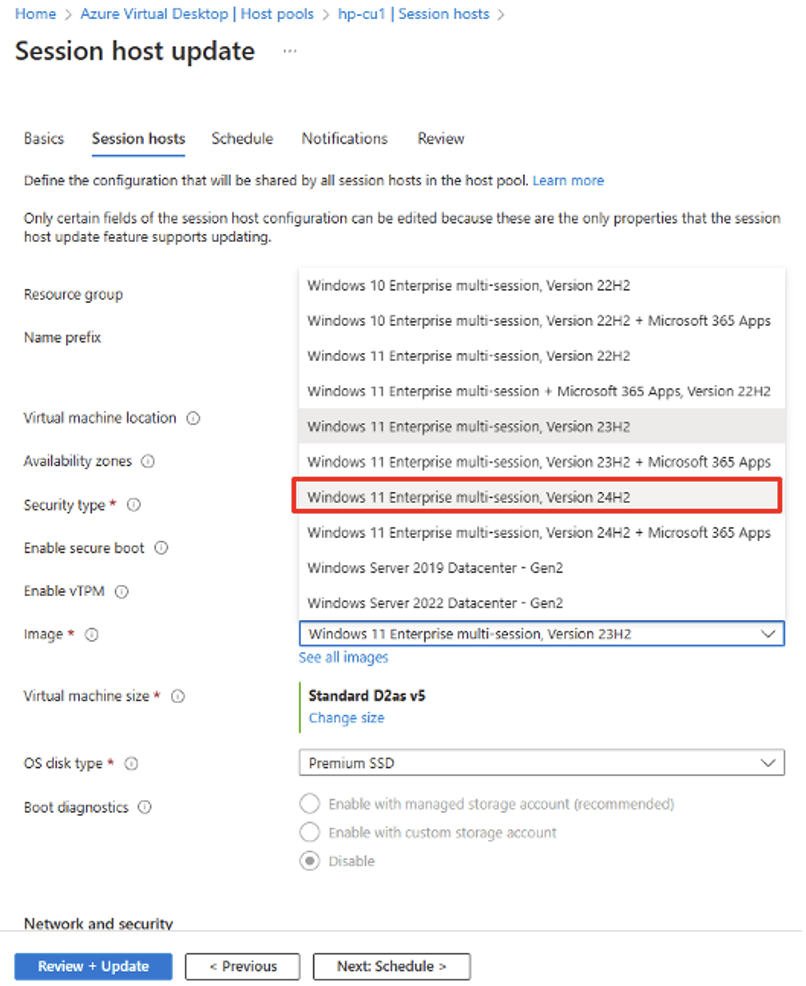 
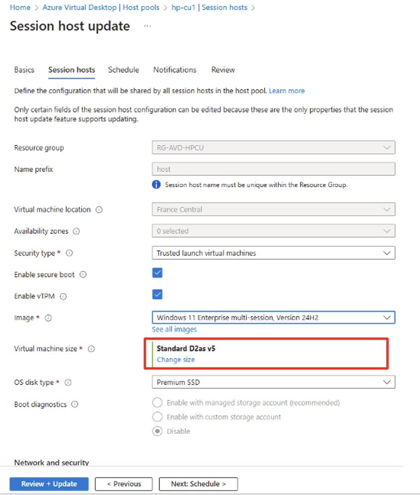 
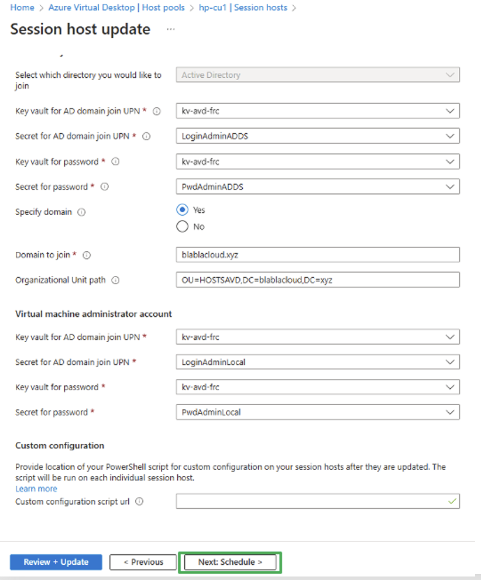   

On définit un horaire pour le déclenchement pour la mise à jour des "session host".  
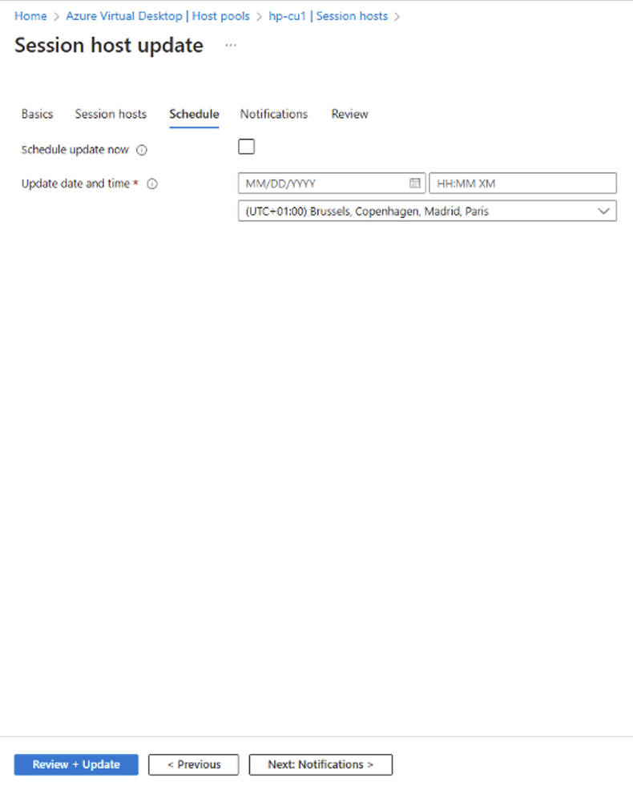  
Et pour finir, la notification pour les utilisateurs et ainsi le temp quand ils ont pour sauvegarder leur travail quand ils se feront déconnecter du "session host" pour sa mise à jour.  
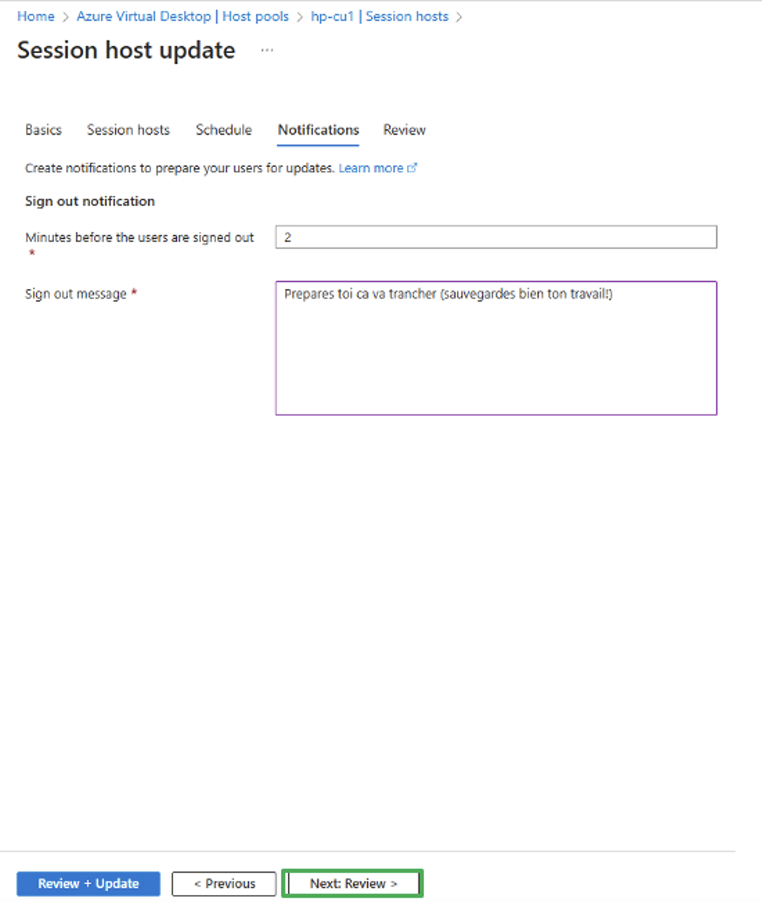  

Une fois que le processus de mise à jour est lancé.  
- Le service prend un "session host" pour les tests et il positionne le "drain on" dessus (plus de connexion dessus)
- les utilisateurs connectés sur le "session host" sont notififiés et déconnectés
- Le "session host" est supprimé dans Azure mais le **compte ordinateur dans l'AD n'est pas supprimé**
- Il crée les nouvelles ressources Azure en NOM DE LA RESSOURCE-TIMESTAMP (ex: VM1-0-2023-04-15T17-16-07)
- Le nouveau "session host" est joint au domaine à l'aide de l'extension 
- Il hérite des propriétés de l'ancien compte machine de l'AD (GPO à activer "") et rompt la relation de confiance existante avec les VM précédentes
- Le nouvel "session host" est joint au pool d'hôtes existant, le mode "drain" est désactivé et le "session host" peux accepter des connexions
- Une fois testé il met à jour les autres "session host" par lots
  
Déclenchement de la mise à jour des "session host". 
Test du premier "session host" - Drain mode "on" 
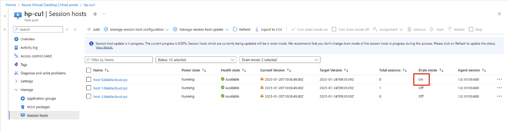  
Déploiement du nouveau "session host" avec une nouvelle image (ressource avec un TIMESTAMP)
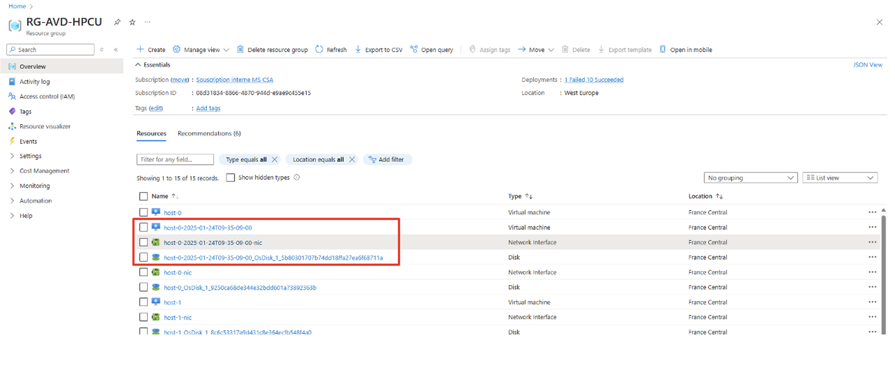  
Test terminé avec la nouvelle version du premier "session host"
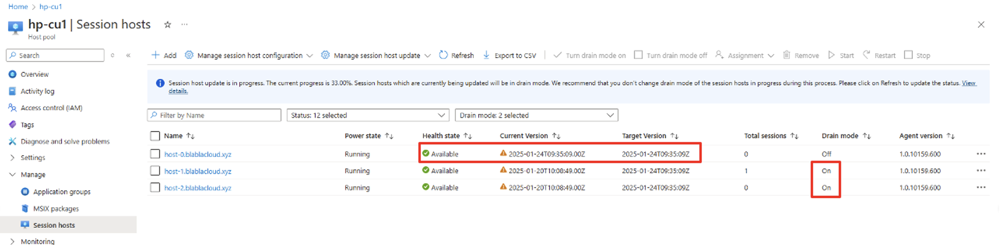  
Orchestration de la mise à jour des autres "session host"
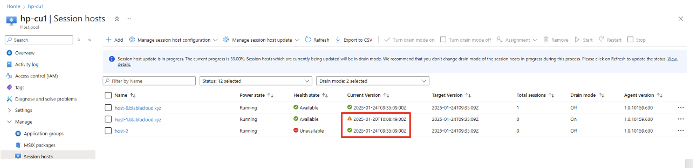 
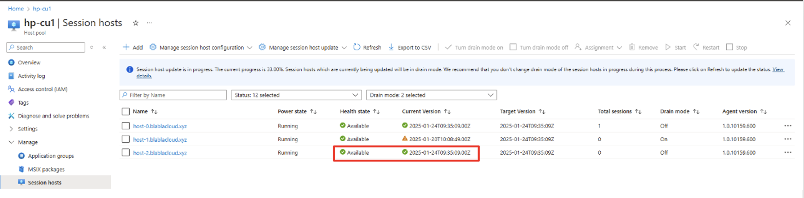 
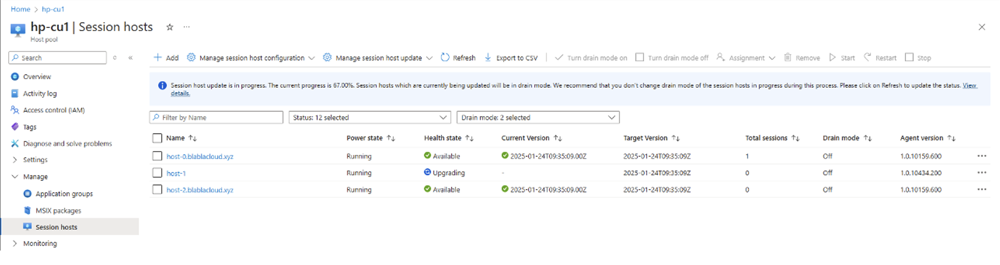 
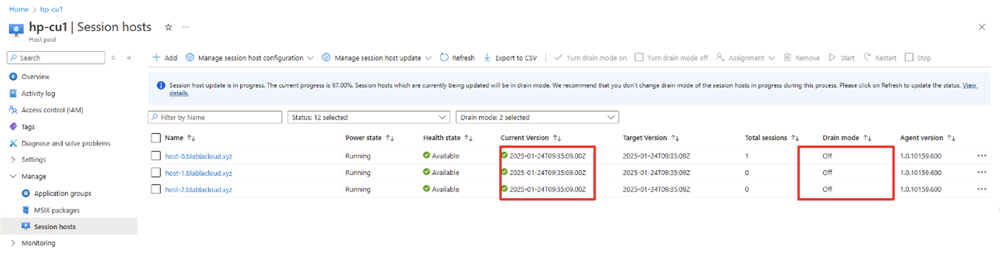   

Pour examiner ce sujet un peu plus en profondeur: 
Une excellente vidéo :-):
https://www.youtube.com/watch?v=MCuPJdr3Zb4  
https://learn.microsoft.com/en-us/azure/virtual-desktop/host-pool-management-approaches#session-host-configuration  

 

