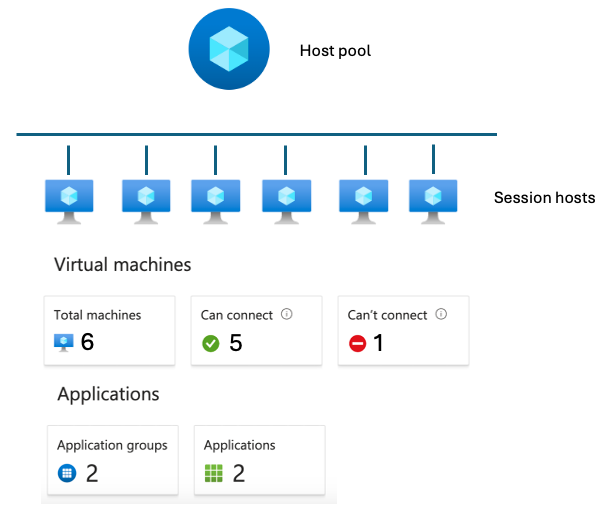

# "Host-pool-management-approaches"
  
Actuellement pour gérer le cycle de vie des **"Session hosts"** dans un **"Host Pool Azure virtual Desktop (AVD)"**, cela peut se faire avec plusieurs approches:
- Avec Microsoft Intune
- Avec la création de nouvelles images
- Avec la combinaison des deux

## Avec Microsoft Intune
L'intégration d’Azure Virtual Desktop (AVD) avec Microsoft Intune permet de gérer les machines virtuelles (Session hosts) de manière centralisée, en appliquant des stratégies de sécurité, des mises à jour et des configurations aux VMs. Microsoft Intune permet une gestion centralisée des VMs AVD sans nécessiter une **reconstruction régulière des images de VMs (hosts AVD)**.

## Avec la création de nouvelles images
La gestion des mises à jour des machines AVD avec de nouvelles images permet d'éviter une dette technique (mise à jour des applications) et de garantir des performances stables. Cela nécessite de recréer régulièrement des images de VMs (Session hosts AVD) pour appliquer les mises à jour et les applications. Cela peut être fait avec des outils comme **"Azure Image Builder ou Packer (HashiCorp)"** et des chaînes de déploiement tel que **"Azure DevOps/ GitHub / ..."**. 
Avec cette approche, on est obligé de gérer les mises à jour des sessions hosts soit en **créant un nouveau "Host pool"** avec les nouvelles images ou soit **en ajoutant des nouveaux "Session host" à un "Host pool"** avec les nouvelles images. 
**Création d'un nouveau "Host pool"**: 
- Crétion d'une nouvelle image en la stockant dans **"Azure Compute Gallery"**
- Redéploiement d'un "Host pool" avec la nouvelle image
- Nettoyage de l'Entra ID ou de l'Acive Directory ( comptes machine)
- Re création d'**Application group & "Assignments"**

**En ajoutant des nouveaux "Session host" à un "Host pool"**: 
- Crétion d'une nouvelle image en la stockant dans **"Azure Compute Gallery"**
- Génération d'une nouvelle clé au niveau du **"Host pool"** pour l'ajout des nouveaux **Session host**
- Déploiement des nouveaux **Session host**
- jouer avec le "Drain mode"

## Avec la combinaison des deux
Utiliser Intune si l'on veut une gestion continue et éviter de recréer les VMs fréquemment. 
Utiliser la création de nouvelles images si l'on veut garantir des performances stables et minimiser une dette technique sur le long terme. 
Il est possible de combiner les deux approches pour bénéficier des avantages de chacune. Utiliser Intune pour les petits changements et faire des nouvelles images tous les 3-6 mois pour une base propre testée et performante. 
C'est souvent cette option qui est recommandée et utilisée pour les environnements de production. 

## "Host-pool-management-approaches"
Dans le service **"Azure Virtual Desktop"**, les **"host pool"** sont des regroupements logiques de machines virtuelles **"Session hosts"** qui ont la même configuration et servent les mêmes "Workloads". Microsoft propose maintenant une nouvelle 
